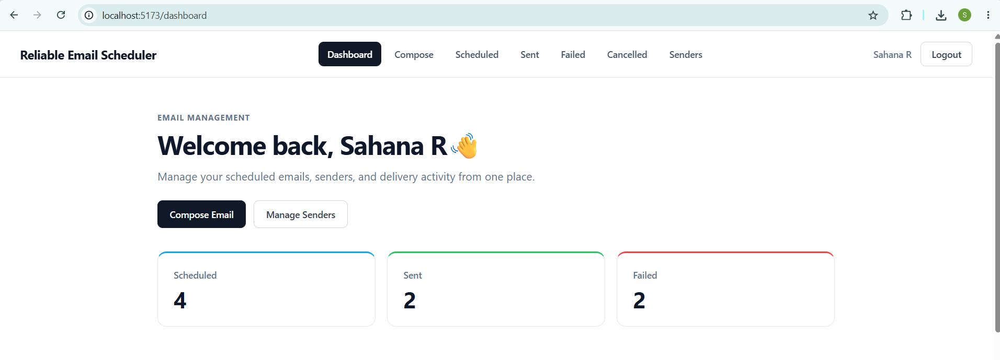
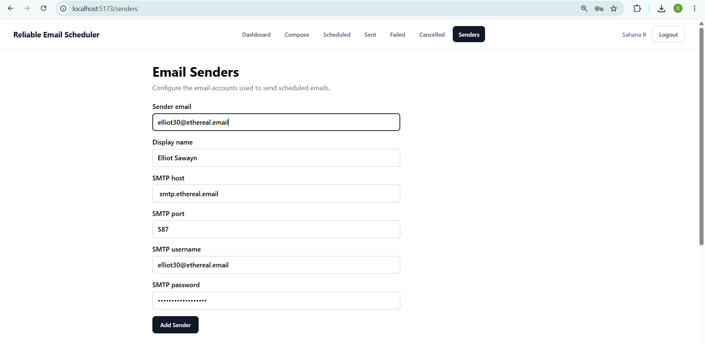

# Reliable Email Scheduler
[](https://github.com/SahanaRSetty/reliable-email-scheduler/actions/workflows/ci.yml)

A reliable distributed email scheduling platform built with Python, FastAPI, PostgreSQL, Redis, Celery, React, and TypeScript.
The system is designed around persistent scheduling, concurrent-safe job claiming, retry handling, idempotency, per-recipient delivery tracking, authentication, and recovery from worker or scheduler interruptions.

## Screenshots

### Dashboard


### Compose Email


### Scheduled Emails


### Sent Emails


### Failed Emails


### Cancelled Emails


### Sender Management


## Why This Project?

This project focuses on reliability problems that occur in real background-processing systems:

- What happens when a worker crashes?
- How do multiple scheduler instances avoid claiming the same job?
- How are failed deliveries retried safely?
- How are duplicate scheduling requests prevented?
- How can partially successful recipient deliveries be tracked?
- How can scheduled jobs survive application restarts?

The architecture is designed to address these failure scenarios explicitly rather than relying on in-memory timers or a single background process.

## Features

- Schedule emails for future delivery
- Persistent PostgreSQL-backed email jobs
- Redis + Celery background processing
- Exponential retry with configurable limits
- Per-recipient delivery tracking
- Idempotency and duplicate prevention
- Recovery of stuck processing jobs
- Email cancellation and manual retry
- Google OAuth authentication
- Encrypted SMTP credential storage
- CSV recipient import
- Dockerized full-stack deployment

## Architecture

                    +----------------------+
                    |    React Frontend    |
                    |     Vite + TS        |
                    +----------+-----------+
                               |
                              HTTP
                               |
                               v
                    +----------------------+
                    |     FastAPI API      |
                    +----+------------+----+
                         |            |
                      SQL|            |Redis
                         |            |
                         v            v
                 +-----------+   +-----------+
                 | PostgreSQL|   |   Redis   |
                 +-----+-----+   +-----+-----+
                       |               |
                       |               v
                       |        +-------------+
                       |        |Celery Worker|
                       |        +------+------+
                       |               |
                       |              SMTP
                       |               |
                       |               v
                       |        +-------------+
                       |        | SMTP Server |
                       |        +-------------+
                       |
                       v
                +---------------+
                |   Scheduler   |
                | Python Poller |
                |    2 seconds  |
                +---------------+


## Email Processing Flow

```text
User schedules email
        |
        v
FastAPI validates request
        |
        v
PostgreSQL stores email + recipients
        |
        v
Scheduler finds due email
        |
        v
Database row lock claims job
        |
        v
Job marked PROCESSING
        |
        v
Celery task queued in Redis
        |
        v
Worker processes recipients
        |
        v
SMTP delivery attempt
        |
        +-------------------+
        |                   |
     Success             Failure
        |                   |
        v                   v
       SENT               Retry
                            |
                            v
                   Exponential Backoff
                            |
                            v
                       Retry Limit
                            |
                       +----+----+
                       |         |
                      SENT     FAILED
```

## Reliability Design

### Persistent Scheduling

Scheduled emails are stored in PostgreSQL instead of relying on in-memory timers.

This ensures scheduled jobs survive application and process restarts.

### Concurrent-Safe Job Claiming

The scheduler uses PostgreSQL row locking with:

```sql
FOR UPDATE SKIP LOCKED
```

This prevents multiple scheduler processes from claiming and processing the same scheduled email simultaneously.

### Exponential Retry Backoff

Failed email deliveries use exponential backoff:

```text
Attempt 1 → 10 seconds
Attempt 2 → 20 seconds
Attempt 3 → 40 seconds
```
Retry settings are configurable through application configuration.

### Restart Recovery

Jobs that remain stuck in `PROCESSING` after an interruption can be recovered and rescheduled.

This prevents temporary worker or scheduler failures from leaving jobs permanently stuck.

### Per-Recipient Delivery Tracking

Each recipient is stored separately.

This allows the system to keep successfully delivered recipients as `SENT` while retrying only recipients that failed.

### Idempotency

Scheduling requests use an idempotency key to prevent duplicate email jobs from being created accidentally.

## Security

- Google OAuth authentication
- User ownership checks on email resources
- User ownership checks on sender resources
- SMTP passwords encrypted before database storage
- Environment-based application configuration
- `.env` excluded from Git
- `.env.example` provided for setup
- Scheduling endpoint rate limiting
- Dedicated non-root Docker user for Celery worker

## Tech Stack

**Backend:** Python, FastAPI, SQLAlchemy, Alembic, PostgreSQL, Redis, Celery, Authlib, Cryptography, SMTP

**Frontend:** React, TypeScript, Vite, React Router, Axios, Sonner

**Infrastructure:** Docker, Docker Compose, Nginx

## Docker 

The application is containerized with Docker Compose across PostgreSQL, Redis, FastAPI, Celery Worker, Scheduler, and Nginx frontend services.

## Running with Docker

### Prerequisites

Install:

- Docker Desktop
- Git

### Configuration

Copy the example environment file:

```powershell
Copy-Item .env.example .env
```

Then update `.env` with your own values for:
```text
POSTGRES_PASSWORD
GOOGLE_CLIENT_ID
GOOGLE_CLIENT_SECRET
GOOGLE_REDIRECT_URI
SMTP_ENCRYPTION_KEY
```
Never commit `.env` to Git.

### Start the Full Stack

```powershell
docker compose up -d --build
```

### Check Containers

```powershell
docker compose ps
```

Expected services:
```text
reliable_email_postgres
reliable_email_redis
reliable_email_backend
reliable_email_worker
reliable_email_scheduler
reliable_email_frontend
```
### View Logs

Backend:

```powershell
docker compose logs backend
```

Worker:

```powershell
docker compose logs worker
```

Scheduler:

```powershell
docker compose logs scheduler
```

### Stop the Stack

```powershell
docker compose down
```

## Application URLs

Frontend:

```text
http://localhost:5173
```

Backend API:

```text
http://localhost:8000
```

Swagger API documentation:

```text
http://localhost:8000/docs
```

## Testing

Run the backend test suite:

```powershell
pytest backend/tests -v
```

The current test suite contains 52 automated tests.
The automated tests cover areas including:

- Email scheduling
- Authentication
- User ownership
- Sender management
- Cancellation
- Email deletion
- Manual retry
- Rate limiting
- Duplicate prevention
- Scheduler job claiming
- Restart recovery
- Worker processing
- Retry behavior
- Recipient status tracking
- Failure handling

## API Documentation

When the backend is running, interactive Swagger documentation is available at:

```text
http://localhost:8000/docs
```

The API can be explored directly through the FastAPI Swagger interface.

## Development

### Backend

From the project root:

```powershell
cd backend
uvicorn app.main:app --reload
```

### Frontend

From the project root:

```powershell
cd frontend
npm install
npm run dev
```
